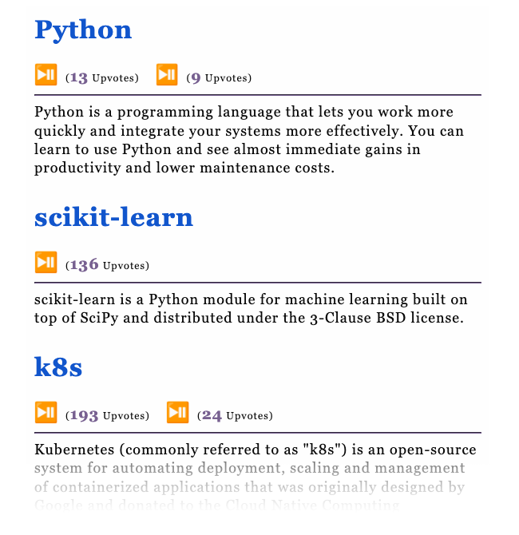
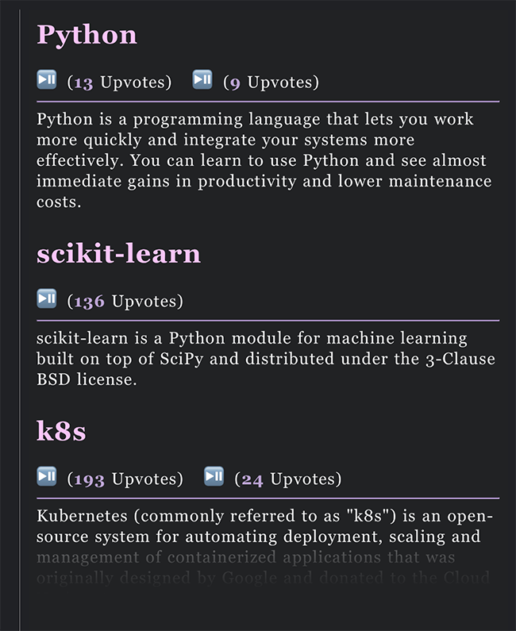

<h1 align=center>
  HowToPronounce Readwise
   
</h1>
<h4 align=center>
  Push <a href="howtopronounce.cc">howtopronounce.cc</a> tech terms in the <i>Readwise</i> fashion.
</h4>
<h4 align="center">
  
</h4>

## Introduction

[HowToPronounce: the pronunciation dictionary](howtopronounce.cc) is a website that tells you How to pronounce programming and computer science terms in English. It’s handy for retrieving tech terms you are interested in but do not sure how to pronounce.

This repo helps you learn about all these terms in the _Readwise_ way. _Readwise_ sends you a daily email resurfacing your history highlights. Similarly, this repo will send you a daily email containing tech terms from [HowToPronounce: the pronunciation dictionary](howtopronounce.cc), including all possible pronunciations with upvotes and concise description of the word.
## Email preview

<table align="center" border="0">
<tr><td align="center"><b>Platform</b></td><td align="center"><b>Preview</b></td></tr>
<tr><td align="center">

### Apple Mail   Microsoft Outlook 2021

</td><td align="center"></td></tr>
<tr><td align="center">

### Gmail

</td><td align="center"></td></tr>
<tr><td align="center">

### Gmail.app

</td><td align="center"></td></tr>
</table>

## How to deploy

Deploy this service with your GitHub account is straightforward.

1. First fork this repo to your GitHub repositories
2. and then create following secrets in your fork settings (first read this [troubleshooting](https://github.com/marketplace/actions/send-email#gmail) if you are going to use Gmail as `SENDER_EMAIL`):
    - `SENDER_EMAIL`
    - `SENDER_PASSWORD`
    - `RECEIVER_EMAIL`

## Known issues

### Media player

[[source]](https://www.dyspatch.io/blog/audio-in-email-its-possible/)

- Apple iOS supports the media player
- Apple Mail supports the media player
- Outlook 2016 supports the media player
- Gmail will show the fallback text
- **[NOT TRUE for the 2021 version]** Outlook 2017 and above will show the fallback text
